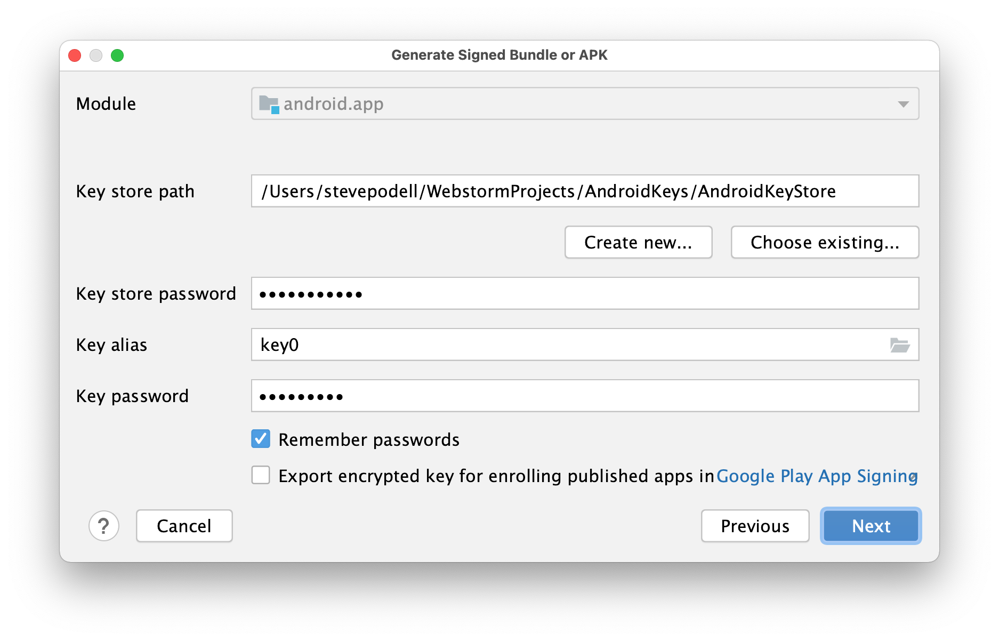
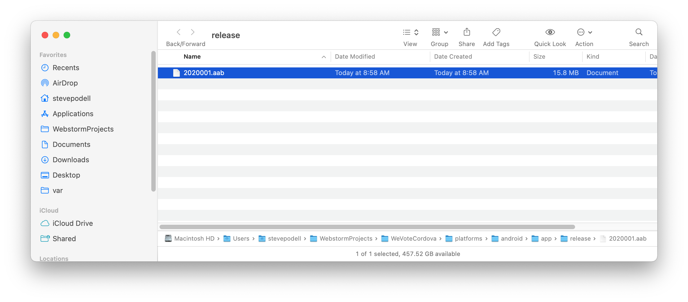

# Making an Android release

1. Test and complete your new version
    1. Test on the "AVD" Simulators
        1. On a common phone like Google's Nexus 6, or one of the latest Samsung or Motorola phones
        1. Test on an Android tablet, like Google's Nexus 10
    2. Get access to a current Android device and test on it.  You can just plug it in with a USB cable.  Unlike Apple, the Android 
    manufacturers have little incentive to keep their old phones, current with the latest OS.  So phones probably become out of date 
    for android testing in a year or so.  2021:  I found a very nice current model Samsung Galaxy A11 on Amazon for $69, it comes configured for Tracfone, but 
    there is no need to activate its cell services, and it works fine as a WIFI only device.

2. Bump the android release version number in ```platforms/android/app/src/main/AndroidManifest.xml```

   On the line that says something like...
   
   ```<manifest android:hardwareAccelerated="true" android:versionCode="100001" android:versionName="1.0.3" package="org.wevote.cordova" xmlns:android="http://schemas.android.com/apk/res/android">```
   
   Increment the `android:versionCode` by one, and update the `android:versionName` as desired (this usually should be the same
    as the new iOS release name that we are releasing at the same time).

3. Make sure your changes are in a pull request against the WeVoteCordova project, and ideally merged!

4. Generate a signed "Android App Bundle" an AAB file (a file that contains the entire app, with duplicate code removed).  Bundles are about half the
size of the prior packaging output file (the APK).  AAB files are required for releases to the Google Play Store.


5. Get the signing certificate (AndroidKeyStore file) and access to the WeVote Android developer account from Dale McGrew.  On my machine it is stored here:


6. Make sure your build Variants are set to release


7. Generate a Signed Bundle (aab)


8. After the signing and building, a pop-up will appear that allows you to locate the `app-release.aab` file (the bundle).
 
  If that pop-up disappears before you can "locate" the build, you can rebuild the app, and watch more carefully for the appearance pop-up.

   My app ended up at `/Users/stevepodell/WebstormProjects/WeVoteCordova/platforms/android/app/release`
10. Rename the file to the version code you specified in `<widget android-versionCode="2020001"` (to make it easier to track different builds in the Google Play Console.)
11. Navigate to the [Google Play Console](https://play.google.com/apps/publish/?account=5667543967745776856#AppListPlace), 
and login

    
     Drag the AAB file to the browser "BROWSE FILES" pane on the https://play.google.com/apps/publish/  "Google Play", "App Releases" tab, which uploads the file to Google.

12. Finally, update any marketing documentation on https://play.google.com/apps/publish/ and type in a brief release note
in the English section of the "What's new in this release?" pane.

13. Review, then publish

## Making an APK for Saucelabs testing

The build process in Android Studio, can also be used to build an APK file -- the one you upload to Saucelabs for testing,
it is located at 

    WeVoteCordova/platforms/android/app/build/outputs/apk/debug/app-debug.apk

----------
## Next Step:

**[Return to the WeVote Cordova home documentation page ](/README.md)**

----------
## Other documentation pages:


**[Making an iOS Release](MakingAniOSrelease.md)**

**[Setting up your Computer for Android Development](AndroidSetup.md)**

**[Cordova JavaScript Differences](CordovaJavaScriptDifferences.md)**

**[Testing with localhost from an actual phone](TestingWithLocalHostFromPhone.md)**

